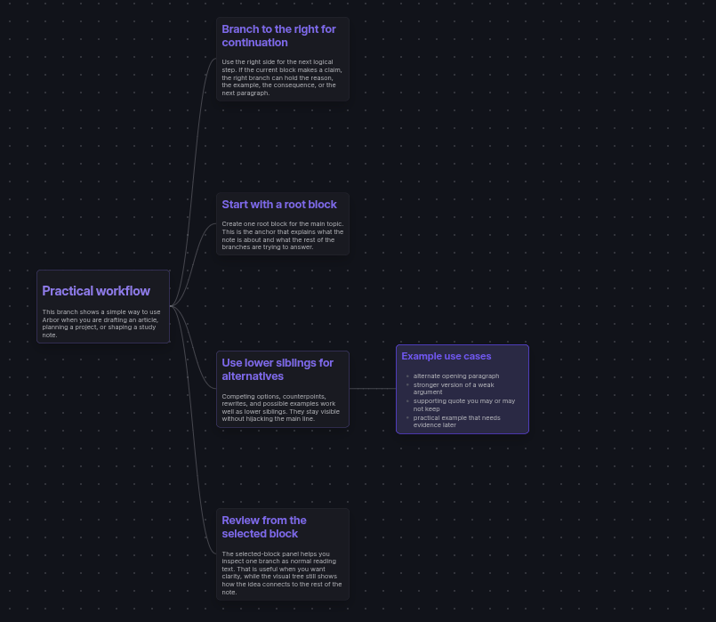

# Changelog

All notable changes to Arbor should be documented in this file.

## Unreleased

## 0.3.1 - 2026-10-11

Capture, connect, focus: bring content into the right branch and stay with the idea you are working on.

### Added

- added text and source-reference drops onto cards, with Paste content into card in block menus and the Command Palette
- added visible New block beside and New child block drop targets in Branch Editor and every Tree Overview orientation
- added image-file drops into existing cards and new blocks, using Obsidian's attachment location and reusing existing vault images
- preserved supported reader-generated excerpts and source references, including PDF++ annotation links, without modifying the source
- added Active zoom in both views: fit the selected card, follow navigation and adapt to editing and pane resizing
- added configurable minimum and maximum zoom within 25–500%, shared by wheel, pinch, menu controls and automatic fitting
- added temporary Focus on branch in both views, with Stop focus and shared focus across view switches

### Improved

- kept Stop zoom and Stop focus together beneath the profile/view controls, with icons and consistent hover states
- smoothed active-zoom camera navigation and retained the horizontal anchor when selecting differently sized sibling cards
- refined draft recovery with readable previews, clear Copy/Restore/Discard/Later actions and narrow-screen touch targets
- refreshed installation, feature and contributor documentation and the pull request template

### Fixed

- stopped active zoom at 100% within configured limits while keeping the selected card visible instead of jumping to the bottom
- prevented competing camera animations during horizontal navigation and sideways jumps during vertical sibling navigation
- rejected conflicting document saves and retained recoverable drafts instead of silently replacing newer content
- kept delayed incoming content from overwriting a changed draft or being inserted into a stale selection
- preserved editing selections, caret updates and owning-window input events in popout windows
- rendered image embeds created by external drops correctly and kept new-block creation/content in one safe mutation

Draft recovery is in memory for the current plugin lifetime, not a crash/restart backup. Physical-device acceptance, minimum-host checks, and exact Book Note CFI navigation remain separate verification work; this release does not claim universal reader-plugin compatibility.

## 0.3.0 - 2026-10-05

Grow in every direction: vertical Tree Overview, card and branch colors, and faster ways to find and connect ideas.

### Added

- added vertical Tree Overview with the root at the bottom or at the top, plus a plugin default and saved per-note layouts
- adapted arrows, Ctrl/Cmd + arrow creation, number navigation and touch controls to the effective Overview orientation and LTR/RTL sibling order; Branch Editor remains horizontal
- added selectable search results with titles, highlighted snippets and paths, keyboard selection, click-to-reveal and mobile-friendly scrolling
- added per-card colors and inherited branch colors with swatches, HEX input, isolated preview and reset controls in both editor modes
- preserved block colors through note reloads, move/duplicate, undo/redo and Tree Overview exports while keeping clean Markdown undecorated
- integrated Heading Linker's public index to automatically link terms and aliases to headings in other cards of the same Arbor note, without changing its Markdown
- respected Heading Linker's Reading highlighting, folder scope, exclusions and per-note opt-out; ambiguous local targets remain unlinked

### Improved

- exported the current horizontal or vertical Overview layout as a PNG or single-page PDF, with upright text and preserved colors
- kept the selected card visible during rapid navigation and centered fitting narrow trees when opened
- reflowed neighbors and connectors around the inline Overview editor while retaining the textarea, draft, focus and caret
- showed long profile names from the beginning with an ellipsis and a gentle hover scroll; added recognizable layout-menu icons
- separated rendering, editing, navigation, document persistence and viewport lifecycles into dedicated modules

### Fixed

- persisted a note's chosen Overview layout across closing/reopening, renaming and sync, without changing other notes, Output Profiles or content undo/redo history
- prevented root/parent columns from jumping when a differently sized descendant branch appears or disappears, while retaining selection animations
- kept common ancestors stationary during child navigation and reduced active-card scrollbar inset without shifting the text
- blended truncated previews into the actual card color instead of painting a mismatched dark rectangle
- applied a branch color to its parent card while retaining independent descendant card overrides
- preserved newer document state when stale loads, saves or unloads complete after switching notes
- scheduled and cancelled editor, navigation and preview timers in their owning windows for popout compatibility
- preserved Tree Overview connector strokes in PNG and single-page PDF exports instead of rendering black filled curves
- respected Obsidian's text font in rendered cards, previews, editors and Tree Overview exports without changing interface, code or custom heading fonts
- opened internal links in Branch Editor and Tree Overview cards with the correct source path, heading/block/PDF subpath, and Obsidian new-pane shortcuts
- kept link clicks, keyboard activation, double-clicks and plugin-handled links separate from card selection and editing
- kept dragging a rendered link separate from moving its entire card
- made copied block links within the same note select and reveal their target directly, without a native protocol round-trip
- made same-note heading links select and reveal their containing card while keeping the current Branch Editor or Tree Overview open

## 0.2.9 - 2026-09-15

### Added

- added named Output Profiles so one complete Arbor tree can produce independent Draft, Short, Final, or other versions
- added block-only and subtree include/exclude controls with direct and inherited visual states
- added bulk presets for include all, exclude all, invert, selected branch only, root blocks only, and reset
- added Output Preview inside the current Arbor view, using the same filtered projection as clean Markdown export
- added clean-export handling for omitted blocks or safely preserved HTML comments, with independent YAML keep/remove choices

### Changed

- tree mutations, duplicate, delete/lift, reload, and Arbor undo/redo now preserve effective Output Profile choices
- existing notes continue to open as `Full tree` without adding output metadata until a custom profile is used
- malformed output metadata remains untouched until the user explicitly resets it

### Fixed

- kept visible block markers on their own lines after reparenting beneath a block with no trailing separator
- removed Arbor labels and block IDs from excluded content preserved as HTML comments in clean exports
- generated numbered clean-export filenames reliably, including for notes stored in the vault root
- refreshed Output Profile styling immediately in both the Branch Editor and Tree Overview
- kept Output Profile and Tree Overview controls interactive while moving between presentation modes
- prevented stale Tree Overview selection animations and profile renders from overwriting the latest state
- removed duplicate native tooltips from excluded cards while preserving accessible Obsidian tooltips
- refined mobile spacing for the Output Profile control

## 0.2.8 - 2026-09-07

Take Arbor with you: official phone and tablet support, while keeping the same Markdown notes.

### Added

- added a focused mobile Branch Editor with touch navigation, block actions, and accessible save/cancel controls
- added one-finger Tree Overview panning and two-finger pinch zoom
- adapted loading, legacy-note recovery and PNG/single-page PDF export limits for mobile devices

### Fixed

- lowered the minimum zoom to 25% and scaled mobile Branch Editor cards, text and spacing together
- kept breadcrumb selection steady, animating only newly appearing path items
- prevented large Theme Studio previews from overlapping on mobile and removed distracting action-bar shadows

## 0.2.7 - 2026-09-03

### Added

- exported the complete Tree Overview as a PNG or a single-page PDF with Standard (1×), High (2×) and Ultra (4×) quality
- added Theme Studio with Automatic mode, Midnight, Paper, Forest and Rose presets, plus saved custom themes
- added mouse-wheel navigation through sibling blocks and visible parent/child branch columns

### Changed

- moved custom-theme editing into its own live-preview modal, with explicit save, cancel and delete confirmation flows
- Tree Overview now opens editing with Enter or double-click and smoothly reveals an off-screen edited card

### Fixed

- kept the Tree Overview camera stable while opening, saving or cancelling an in-place edit
- kept breadcrumbs clear of the complete editor toolbar

## 0.2.6 - 2026-08-16

### Added

- added a Layout direction setting with Left to right and Right to left modes
- new installations use Obsidian's interface direction as their initial Arbor layout

### Changed

- mirrored the branch editor and Tree Overview for right-to-left writing while preserving normal Markdown and text direction
- mirrored directional keyboard navigation, create shortcuts, breadcrumbs, controls and horizontal wheel movement
- kept the active card visible during deep branch navigation, with smoother focus and breadcrumb transitions

### Fixed

- stabilized viewport movement when moving between visible cards or revealing a new branch column
- kept branch alignment stable in both layout directions

## 0.2.5 - 2026-08-06

### Fixed

- fixed File Explorer inline renaming when the Arbor badge is displayed

## 0.2.4 - 2026-07-30

### Added

- added Tree overview: a connected map of every block in the note, with pan and zoom controls
- added fully rendered Markdown cards that size themselves to their content
- added direct in-card editing for the selected block without leaving the full-tree map
- added keyboard navigation in Tree Overview: arrows move through the tree and numbers select child blocks
- added the full Arbor block menu to Tree Overview cards on right click
- added a one-time in-app release notice that introduces Tree Overview after an update

### Changed

- added a default opening-mode setting for choosing the branch editor or Tree Overview
- lowered the minimum zoom level to 50% for large trees
- preserved keyboard focus after deleting or changing a block, so arrow navigation stays available
- kept the current Tree Overview visible while structural updates are prepared, avoiding flashes during Ctrl/Cmd + arrow creation
## 0.2.3 - 2026-07-30

Readable Markdown, safer navigation, and smoother movement between Arbor and Obsidian.

### Added

- added a readable structure footer and automatic migration for older Arbor notes
- added the ARBOR File Explorer label for managed notes
- added clean Markdown export copies with an optional YAML frontmatter
- added Copy block link for opening a specific Arbor block from another note
- added numeric child navigation: type a child number, or use 0 to return to the parent block

### Changed

- moved New arbor note into the File Explorer creation section for folders and empty space only
- improved the normal Markdown switch so managed notes do not reopen Arbor immediately
- refined export modal controls and File Explorer labels for clearer interaction

## 0.2.2 - 2026-05-16

### Changed

- raised the minimum Obsidian version to 1.7.2 for `Workspace.revealLeaf`
- added GitHub build provenance attestations for release assets

### Fixed

- aligned DOM and instance checks with Obsidian API practices
- replaced CSS `!important` declarations with selector specificity

## 0.2.1 - 2026-03-27

Submission review follow-up.

### Changed

- removed unnecessary `async` declarations from the loading view lifecycle methods flagged by the review bot

## 0.2.0 - 2026-03-27

Precise note format and opening-flow upgrade.

### Added

- added visible `arbor:block:v1` markers before each block while keeping hidden Arbor metadata at the end of the file
- added a dedicated `arbor-loading` view for managed notes opened from the file explorer
- added exact migration from legacy metadata-only Arbor notes to the new marker-backed format
- added `New arbor note` in the file explorer menu with predictable `Untitled`, `Untitled 1`, `Untitled 2` numbering
- added reviewer-facing tests for opening rules, marker parsing, migration, and false-positive protection

### Changed

- Arbor now restores structure from visible markers precisely instead of falling back to coarse heading-only recovery
- managed-note auto-open now trusts metadata-backed Arbor notes instead of marker-like snippets in normal markdown files
- managed notes open through an Arbor-controlled loading shell instead of briefly showing the standard markdown view
- improved created note handling so new Arbor notes open in the main pane instead of spawning a side split
- tightened runtime cache invalidation for managed notes across modify, rename, and delete events

## 0.1.9 - 2026-03-26

Local reviewer-check setup.

### Changed

- added local ESLint review checks with `eslint-plugin-obsidianmd`
- replaced `builtin-modules` with Node's built-in `node:module` list in the build config
- fixed local lint findings around globals and unsafe `loadData()` typing

## 0.1.8 - 2026-03-26

Final wording alignment after reviewer follow-up.

### Changed

- aligned the Ctrl/Cmd wheel zoom label across settings, menu UI, and README

## 0.1.7 - 2026-03-26

Reviewer-bot Markdown sentence-case follow-up.

### Changed

- normalized the remaining reviewer-visible `Markdown` UI strings in commands, notices, menus, and banners
- aligned README and manual QA command labels with the updated UI wording

## 0.1.6 - 2026-03-26

Review-bot sentence-case cleanup.

### Changed

- rewrote the remaining reviewer-flagged UI strings to sentence case
- removed extra product naming from notices and setting descriptions where it was not needed

## 0.1.5 - 2026-03-25

Submission rescan follow-up.

### Changed

- capitalized `Markdown` in the plugin description for consistency
- published a new patch release to make the updated plugin state explicit during review

## 0.1.4 - 2026-03-25

Reviewer-bot compliance follow-up.

### Changed

- fixed lifecycle and promise handling in `main.ts`
- removed deprecated leaf APIs and updated activation calls
- cleaned sentence case in reviewer-visible UI text
- removed direct `element.style.*` writes flagged by the bot
- removed unnecessary assertions and unused imports

## 0.1.3 - 2026-03-25

Command ID cleanup before review.

### Changed

- removed the plugin name from the command IDs reviewers are likely to inspect

## 0.1.2 - 2026-03-25

Validation follow-up release.

### Changed

- removed `Obsidian` from the public plugin description to match submission rules

## 0.1.1 - 2026-03-24

Submission polish and release fixes.

### Changed

- moved demo note generation into the shipped plugin bundle
- switched note persistence to `Vault.process()`
- separated community-plugin install, manual install, and contributor workflow docs
- removed the single-section settings heading
- cleaned up manual QA command names and editor behavior notes

## 0.1.0 - 2026-03-24

Initial public-ready repository pass.

### Added

- Arbor branding across the plugin
- writing-first branching editor with in-note metadata
- selected block panel, search overlay, zoom, and view menu
- drag-and-drop reordering and reparenting
- block-level undo/redo
- automated tests and manual QA checklist
- repository documentation and scaffolding
