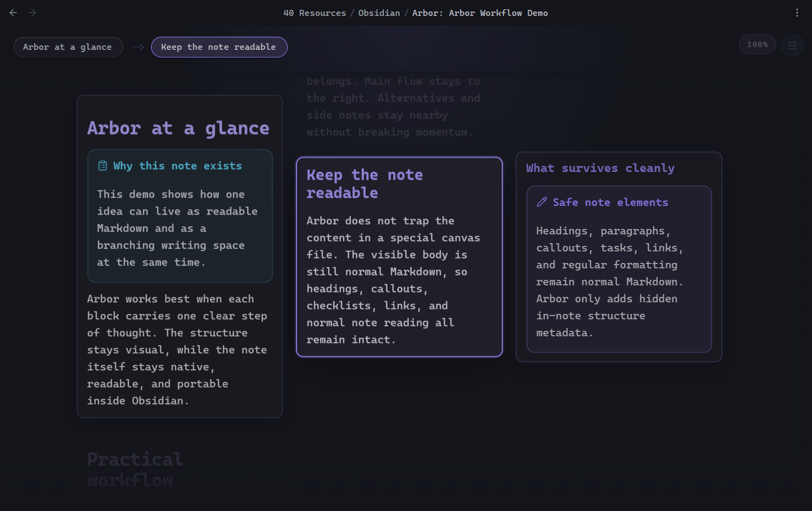

# Arbor

Think in branches. Keep one note.

Arbor is a writing-first branching editor for Obsidian. It lets you build a note as small Markdown blocks arranged left-to-right while keeping the note itself as a normal `.md` file.

No export step. No separate canvas file. No sidecar database.




The core idea:

- write in short blocks instead of one long wall of text
- see the current branch, nearby alternatives, and next steps at the same time
- reorganize ideas without copy-paste chaos
- stay inside one note instead of splitting thoughts across many files

Arbor is desktop-only. It currently requires Obsidian `>= 1.5.12` and was tested on Obsidian `1.12.4`.

## Why Arbor

Arbor is for notes where order matters, but thought does not arrive linearly.

Good fit:

- article and essay drafting
- study notes with branches and alternatives
- argument building
- structured brainstorming
- rewriting and rearranging long notes without losing the original Markdown

Arbor is not a canvas, mind map, or whiteboard. It is still note editing, just with a branching spatial view.

## Core Features

- Left-to-right branching editor for one Markdown note
- Stable block tree with inline editing
- Normal readable Markdown body as the source document
- Hidden in-note metadata for structure, IDs, and ordering
- Selected block panel with focused preview and inline editing
- Context-aware dimming so the active branch stays readable
- Drag-and-drop reorder and reparent
- Keyboard-first navigation and structure editing
- Search overlay for block-level search
- Zoom, breadcrumbs, view menu, and context menus
- Auto-open managed Arbor notes in Arbor view
- Safe rebuild when the note changed in plain Markdown mode

## Install

### Community Plugins

Once Arbor is approved in the Obsidian community catalog:

1. Open `Settings -> Community plugins -> Browse`.
2. Search for `Arbor`.
3. Install it.
4. Enable it.

### Manual install

If you want to install Arbor before it appears in the community catalog:

1. Download `manifest.json`, `main.js`, and `styles.css` from the latest [GitHub release](https://github.com/Kpyruy/Arbor/releases).
2. Create this folder in your vault:

```text
.obsidian/plugins/arbor
```

3. Place those three files inside it.
4. Open Obsidian.
5. Go to `Settings -> Community plugins`.
6. Enable `Arbor`.

## Quick Start

1. Open any Markdown note.
2. Run `Open view for current note`.
3. Create a root block.
4. Press `Enter` on a selected card to edit it.
5. Use `Ctrl/Cmd + Arrow` to grow the structure.
6. Use the right-click menu to duplicate, move, delete, or continue a branch.
7. Turn on `Selected block panel` from the Arbor menu if you want a focused preview/editor panel.

## Support

If Arbor is useful to you, you can support development here:

- [Buy Me a Coffee](https://buymeacoffee.com/kpyr)

## Built-In View Shortcuts

These work inside Arbor itself. They are not command-palette bindings.

### Navigation

| Shortcut | Effect |
| --- | --- |
| `ArrowUp` | Select previous sibling |
| `ArrowDown` | Select next sibling |
| `ArrowLeft` | Select parent |
| `ArrowRight` | Select first child |
| `Home` | Jump to first sibling |
| `End` | Jump to last sibling |
| `Backspace` / `Delete` | Delete the selected block |
| `Enter` | Edit the selected block |

### Editing

| Shortcut | Effect |
| --- | --- |
| `Enter` in editor | Save block and leave edit mode |
| `Shift + Enter` | Insert newline inside the block |
| `Escape` | Cancel current edit |
| `Ctrl/Cmd + Z` in editor | Native text undo inside the current textarea |

### Structural creation

| Shortcut | Effect |
| --- | --- |
| `Ctrl/Cmd + ArrowUp` | Create sibling above |
| `Ctrl/Cmd + ArrowDown` | Create sibling below |
| `Ctrl/Cmd + ArrowRight` | Create child to the right |
| `Ctrl/Cmd + ArrowLeft` | Create a block to the left at parent level |

Notes:

- `Ctrl/Cmd + ArrowLeft` is intentionally conservative and does nothing when the selected block is already at the root level.
- Arbor uses `event.code` for view-level shortcuts where needed, so layout-dependent bindings like search remain stable across keyboard layouts.
- `Delete subtree` shows a confirmation modal. Normal `Delete block` does not.

### Search and zoom

| Shortcut | Effect |
| --- | --- |
| `Ctrl/Cmd + F` | Open Arbor search overlay |
| `Ctrl/Cmd + Z` | Undo the last Arbor structural/content change |
| `Ctrl/Cmd + Shift + Z` | Redo the last undone Arbor change |
| `Ctrl/Cmd + Mouse wheel` | Zoom the scene if zoom is enabled in settings |
| Click zoom indicator | Reset zoom to `100%` |

## Command Palette Actions

All of these are exposed as normal Obsidian commands. By default, they have no bound hotkey unless you bind one yourself in Obsidian.

| Command | ID | Scope | Default hotkey |
| --- | --- | --- | --- |
| Open view for current note | `open-view` | Global | None |
| Create new note | `create-note` | Global | None |
| Create new note in Markdown editor | `create-note-markdown` | Global | None |
| Create demo note | `create-demo-note` | Global | None |
| Open block actions menu | `open-block-actions-menu` | Arbor view | None |
| Create new root block | `new-root-block` | Arbor view | None |
| Create sibling above | `create-sibling-above` | Arbor view | None |
| Create sibling below | `create-sibling-below` | Arbor view | None |
| Create child to the right | `create-child-right` | Arbor view | None |
| Create block to the left at parent level | `create-parent-level-block-left` | Arbor view | None |
| Select parent block | `select-parent-block` | Arbor view | None |
| Select previous sibling block | `select-previous-sibling-block` | Arbor view | None |
| Select next sibling block | `select-next-sibling-block` | Arbor view | None |
| Select first child block | `select-first-child-block` | Arbor view | None |
| Select first sibling block | `select-first-sibling-block` | Arbor view | None |
| Select last sibling block | `select-last-sibling-block` | Arbor view | None |
| Move block up among siblings | `move-block-up` | Arbor view | None |
| Move block down among siblings | `move-block-down` | Arbor view | None |
| Move block left to parent level | `move-block-left` | Arbor view | None |
| Move block right to become child of previous block | `move-block-right` | Arbor view | None |
| Delete block | `delete-block` | Arbor view | None |
| Delete subtree | `delete-subtree` | Arbor view | None |
| Duplicate block | `duplicate-block` | Arbor view | None |
| Duplicate subtree | `duplicate-subtree` | Arbor view | None |
| Toggle edit mode | `toggle-edit-mode` | Arbor view | None |
| Reveal current block in linear Markdown | `reveal-current-block-in-linear-markdown` | Arbor view | None |
| Rebuild linear Markdown from tree | `rebuild-linear-markdown-from-tree` | Arbor view | None |
| Rebuild tree from metadata | `rebuild-tree-from-metadata` | Arbor view | None |
| Undo branch action | `undo-branch-action` | Arbor view | None |
| Redo branch action | `redo-branch-action` | Arbor view | None |

## View Menu

Arbor includes a compact view menu in the top-right corner of the editor.

Current menu actions:

- toggle `Selected block panel`
- toggle breadcrumb path
- toggle breadcrumb flow
- toggle `Ctrl/Cmd + wheel` zoom
- reset zoom to `100%`
- open Arbor settings

## Settings

| Setting | Default | Meaning |
| --- | --- | --- |
| Split direction | `Vertical split` | Where Arbor opens relative to the current note |
| Card width | `300 px` | Base card width in the branching scene |
| Card minimum height | `120 px` | Minimum card height before content expands it |
| Horizontal spacing | `20 px` | Gap between columns |
| Vertical spacing | `12 px` | Gap between sibling cards |
| Default zoom | `100%` | Initial scene scale when Arbor opens |
| Preview snippet length | `220` chars | Maximum preview text for compact card snippets |
| Drag and drop | `On` | Enable drag reorder and reparent |
| Ctrl+wheel zoom | `On` | Allow scene zoom with `Ctrl/Cmd + mouse wheel` |
| Auto-open managed notes | `On` | Open Arbor-managed notes directly in Arbor view |
| Show breadcrumb path | `On` | Show the active path strip at the top |
| Show breadcrumb flow | `On` | Show subtle connectors between breadcrumb items |
| Preferred breadcrumb line prefix | `#` | Prefer the first non-empty line that starts with `#` when generating breadcrumb labels |
| Breadcrumb fallback | `First non-empty line` | What Arbor uses when no preferred-prefix line exists |
| Selected block panel | `Off` | Show the focused preview/editor panel for the selected block |
| Managed metadata block style | `Multiline` | Store hidden Arbor metadata as a multiline or compact HTML comment |

## How Notes Stay Normal Markdown

Arbor does not move your note into a database or sidecar file.

Each Arbor note contains:

- the visible Markdown body
- one hidden metadata block at the end of the same note

Example shape:

```md
# A visible markdown note

This text is still readable in normal Obsidian.

<!-- arbor:metadata:v1
BASE64_ENCODED_JSON
-->
```

Important behavior:

- frontmatter is preserved
- the visible body stays readable if the plugin is disabled
- Arbor keeps stable block IDs in the hidden metadata
- if you edit the note in normal Markdown mode, Arbor will safely rebuild the tree from the visible body instead of silently dropping content

Beautiful blocks in the `> [!note]` style are still normal Markdown callouts. In the screenshots and demo notes, that styling comes from [Callout Manager](https://github.com/eth-p/obsidian-callout-manager).

## Privacy and disclosures

- No account is required.
- No telemetry is collected.
- No ads are shown.
- Arbor does not make network requests for its core functionality.
- Arbor stores plugin settings with Obsidian's plugin data system.
- Arbor stores branch structure inside the note itself as hidden metadata comments.
- If you paste an image into a block, Arbor writes that image into your vault as a normal attachment.

## Demo Notes

Arbor ships with a built-in demo note generator.

Use the command palette action:

- `Create demo note`

The command creates a new Arbor-managed demo note in the current note folder, or in the vault root if there is no active note.

## Compatibility

- Desktop only
- Obsidian `>= 1.5.12`
- Tested on Obsidian `1.12.4`
- Plugin ID: `arbor`
- Current version: `0.1.5`

## Known Limitations

- Arbor is intentionally desktop-first.
- Plain-Markdown rebuild is conservative by design. It protects content first and structure second.
- Undo and redo are Arbor view history, not native editor history.
- Very large notes can still benefit from future virtualization work.

## Roadmap

- richer block search navigation
- stronger conflict handling when Arbor view and plain Markdown both change the same note
- more refinement for very large note trees

## Development

Contributor workflow:

```bash
npm install
npm run dev
```

Release checks:

```bash
npm run build
npm test
```

Manual interaction checks live in:

- `docs/manual-qa.md`

## Repository Layout

```text
arbor/
  assets/
  demo/
  docs/
  src/
    model/
    storage/
    view/
  tests/
  manifest.json
  package.json
  styles.css
```
